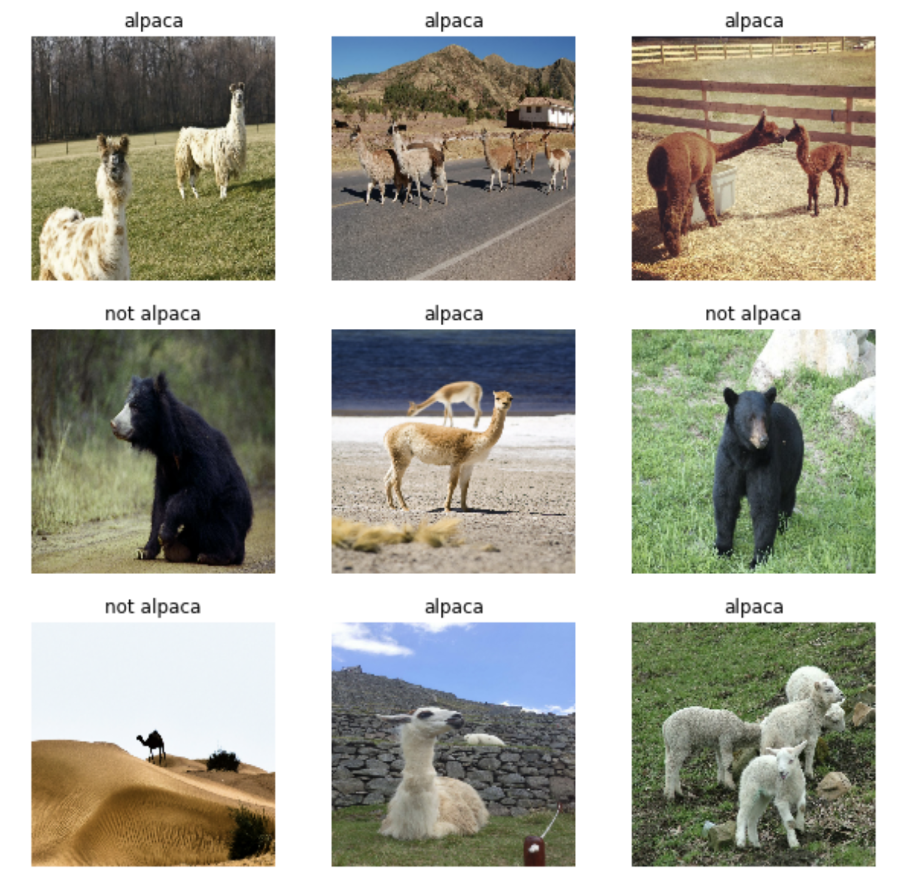

# Transfer learning with MobileNetV2: Alpaca vs non-alpaca classification
We will be doing transfer learning on a pre-trained CNN to build an alpaca vs non-alpaca classifier.

A pre-trained model is a network that's already been trained on a large dataset and saved, which allows you to use it to customize your own model cheaply and efficiently. We use MobileNetV2 that was designed to provide fast and computationally efficient performance. It has been pre-trained on [ImageNet](https://www.image-net.org/), a dataset containing over 14 million images and 1000 classes.

In this project we perform the following tasks:
- Create a dataset from a directory
- Preprocess and augment data using the Sequential API
- Adapt a pretrained model to new data and train a classifier using the Functional API and MobileNet
- Fine-tune a classifier's final layers to improve accuracy  

I did this project in the [Convolutional Neural Networks](https://www.coursera.org/learn/convolutional-neural-networks) course as part of the [Deep Learning Specialization](https://www.coursera.org/specializations/deep-learning).

## Datasets
We have 327 image files belonging to 2 classes in 'alpaca' and 'not alpaca' subdirectories. We use Keras preprocessing with `image_data_set_from_directory()` to create training and validation datasets directly from these files. We use 80% for training and the remaining 20% for validation, resulting in 262 training examples and 65 validation examples. Some examples from the training dataset:

## Residual neural network architecture
We used TensorFlow Keras Functional API to build the ResNet-50 model depicted below. 

We trained the convolutional neural network for 10 epochs with the Keras model's `.fit()` method and evaluated its performance with the model's `evaluate()` method. The model shows the training accuracy of 0.93 and the test accuracy of 0.94.
